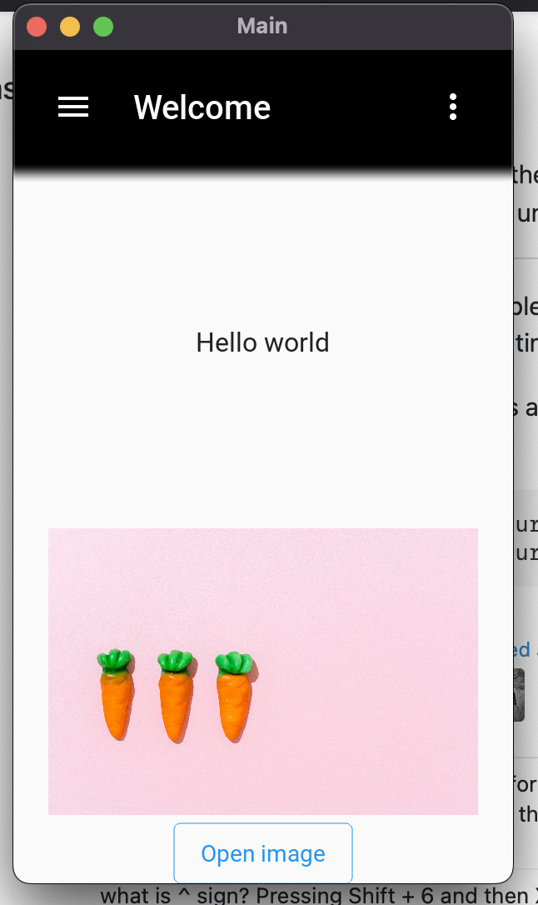

# This is a Camera  Application created with kivy-python.

For running this project you have to download python >= 3.8

## objectives
1. Create a mobile application for make filtres with photos.
   - Local files.
   - Live Camera.
2. Application of machine learning in real uses cases.

Steps
1. Create virtual enviaroments:

    Win
 <pre>python -m venv .venv</pre>
 linux/MacOs
 <pre>python3 -m virtualenv .venv</pre>
Or using anaconda 
 <pre>conda create --name .venv python=3.8</pre>

2. Activate the virtual environment

    Win
 <pre>.venv/Scripts/activate</pre>
 linux/MacOs
 <pre>source .venv/bin/activate</pre>
Or using anaconda 
 <pre>conda ativate .venv</pre>

3. Download the requirements  from requirements.txt

    Win/Conda
 <pre>python -m pip install -r requirements.txt</pre>
 linux/MacOs
 <pre>python3 -m pip install -r requirements.txt</pre>

4. Run the Mobile Application

    Win/Conda
 <pre>python main.py</pre>
 linux/MacOs
 <pre>python3 main.py</pre>

Project adavance:

Las imagenes esn libre de derechos de autor segun pexels.com

Foto de SHVETS production de Pexels: 
Foto de SHVETS production de Pexels: https://www.pexels.com/es-es/foto/fila-juguete-juguetes-plastico-9743228/

Foto de live camera
https://www.pexels.com/es-es/foto/camara-fotografia-tecnologia-lente-9966438/

Credits:
1. [CoOoDe](https://www.youtube.com/watch?v=WKD9FSh5tu4).